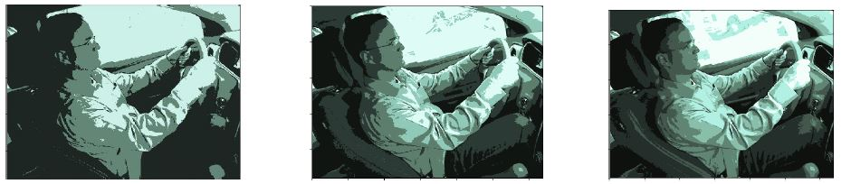

# Detecting Distracted Driver using Machine Learning Techniques

## Overview

### Introduction
Most people tend to follow safety guidelines while driving, yet there is a continuous increase in car accidents every year leading to loss of lives. One major factor that contributes towards the accidents is the driver distractions while driving. Current distracted driving statistics show that 80% of all car accidents are caused by the driver being  distracted in some way. Thus, to reduce the number of car accidents, being able to identify distracted driving is a major task.

### Problem Description
The goal of this project is to detect if the car driver is driving safe or performing any activity that might result in a accident or any harm to others. The dataset contains various driver images, each taken in a car with a driver performing some activity in the car. We are determined to classify the likelihood of what the driver is doing in each image. We aim to use various Machine Learning techniques to classify driver’s activities and identify a model that yields the highest accuracy. The model is trained on image data that are the images of driver's actions in the car. This is a multi-class classification problem, with a total of 10 classes including a class of ‘safe driving’. The image below gives the 10 classes:

### Dataset
Our [`Dataset`] is from a 2016 Kaggle competition with a collection of 22,500 640x480 RGB labelled images as training data and 70,000 unlabelled images as test data. 

## Implementation

### Pre-processing
Image classification is best done by extracting features. So we pre-processed these images by resizing them to 64X64 RGB and extract 
various features using:

• Pixel

• HOG Feature Descriptor 

• Sobel Edge Descriptor

• Clustering

#### 1. Pixels:
Each image’s pixels is flattened into a column vector of size 64X64X3. We then combined the vectors for each of the data instances and created a matrix as the input data to our models.

#### 2. HOG Feature Descriptor:
Count occurrences of gradient orientation in localized portions. Stacked all the HOG gradient features to generate a feature matrix. We then combined the vectors for each of the data instances and created a matrix as the input data to our models.

#### 3. Sobel Edge Descriptor:
Obtained edges using Sobel gradient in X and Y direction. Then computed the resultant gradient. Stacked all the object edges as feature vector then combined the vectors for each of the data instances and created a matrix

#### 4. K Means Clustering:

Resize image to 64x64 RGB image. To reduce the number of features we decided to create a clusters. Hence, implement K means clustering on each image with K=3, middle image (in our case). Stack cluster fe atures to create feature matrix.

### ML Algorithms

Below listed are the Machine Learning algorithms we experimented to predict the classes:

1.  Decision Trees
2.  Support Vector Machines (SVM)
3.  Random Forests
4.  2-Layered Neural Networks
5.  Convolutional Neural Networks (CNN)
6.  VGG16 Architecture

We split labelled dataset into 75% Train, 15% Validation and 10% Test data to evaluate our model. We were able to achieve an average accuracy of ~ 94%. 

### Environmental Requirements

1. Any IDE or terminal to execute Python scripts
2. Pre-installed Python Libraries
    - Numpy
    - Pandas
    - Scikit learn
    - TensorFlow
    - OpenCV
    - MatplotLib
    - Glob
 3. Jupyter notebook to execute .ipynb files
 
### Conclusion

Feature extraction is an important step in any machine learning problem. Selection of model play a crucial role. Good features are needed for Dimensionality Reduction. Generalized accuracy depends on distribution of real world data in comparison to test data. The best results were obtained using a **CNN with VGG16 architecture**

### Applications

Our models are applicable to the following applications and many more
1.  If installed in a car, it can alarm/warn if the driver is distracted.
2.  In semi-autonomous vehicles, the vehicle can take control if the driver is distracted.
3.  Government can use to enforce laws on safe & distraction free driving.
4.  Auto Insurance companies can use these models in re-writing auto policies.

[`Image Source`]

[`Image Source`]: http://cs229.stanford.edu/proj2019spr/report/24.pdf
[`Dataset`]: https://www.kaggle.com/c/state-farm-distracted-driver-detection/data

